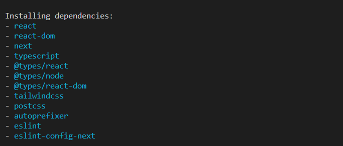
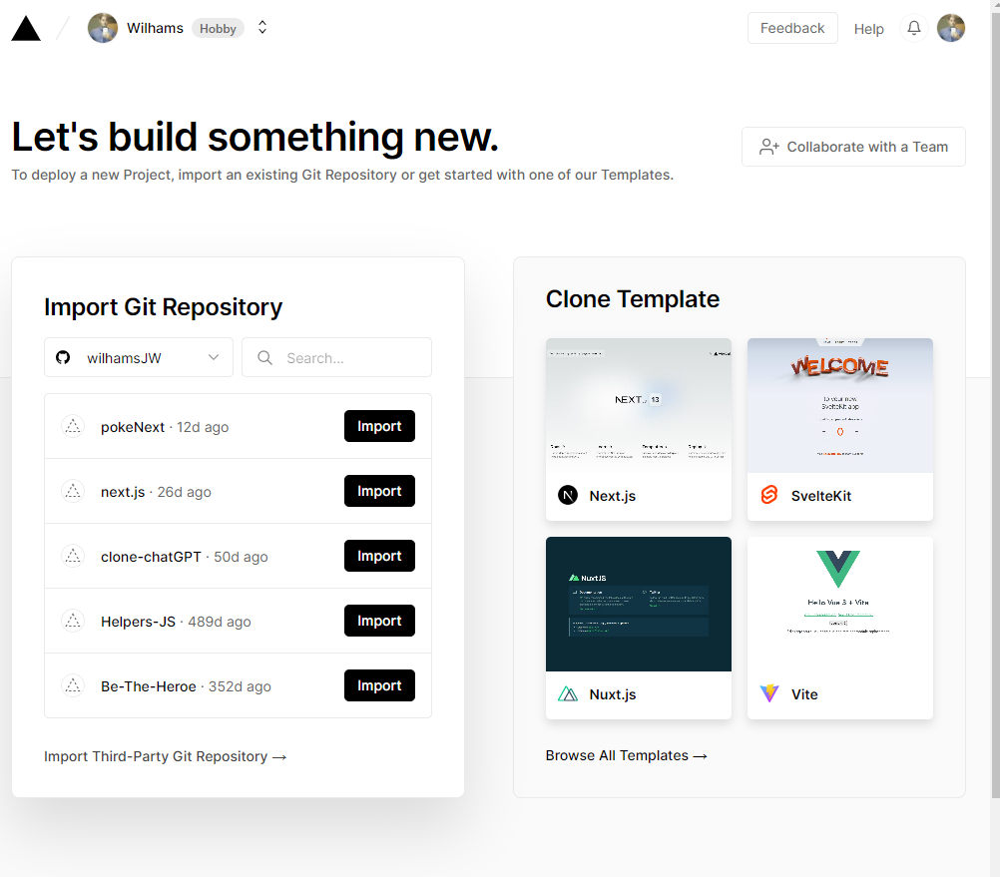
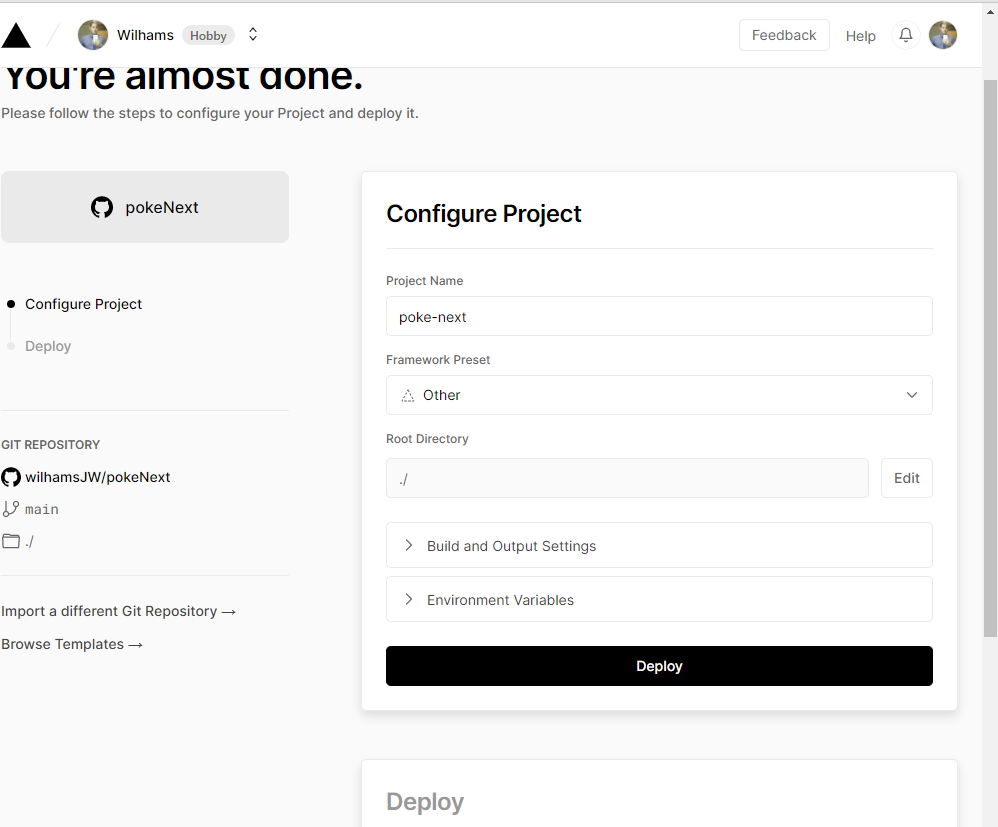

# PokeNext
Here we will find a project with Next.js

## Commands used in installation

1. npx create-next-app .

### Installed dependencies

  

#### Observation: https://github.com/wilhamsJW/pokeNext/commit/ca8a5f691c49fa754d3ef41505d574be6d9f47e4

we add DNS since we are using external server

### Como foi criado a pasta dinâmica?

1. Crie uma pasta dentro de pages, a que criamos foi a pasta 'pokemon'

2. Dentro da pasta criada crie uma arquivo com esta sintaxe `[pokemonID].js` deve haver [] ao redor do nome

`IMPORTANTE:` No arquivo `card.js` temos essa parte da linha de código:
   ##### href={`/pokemon/${pokemon.id}`}>Detalhes...
   este `/pokemon/${pokemon.id}` se refere a pasta criada dentro de pages chamada `pokemon` que dentro dela colocamos o que foi descrito no passo `2`, dessa forma o `Next.js` já entende que se trata de rotas dinãmicas e irá atuar para que a mágica aconteça

   ### How to Deploy?

   1. npm run build 

   2. Próximo passo é criar uma conta na `vercel` após criar ela, continue com github q fica mais fácil a importação
   O vercel irá identificar seus projetos e aparecerá nessa tela (click em import):

  

    
  

  3. Irá aparecer esta tela (click em deploy) (Irá ser feito o build, runnig checks e irá no dá um DNS)

  

    
  
